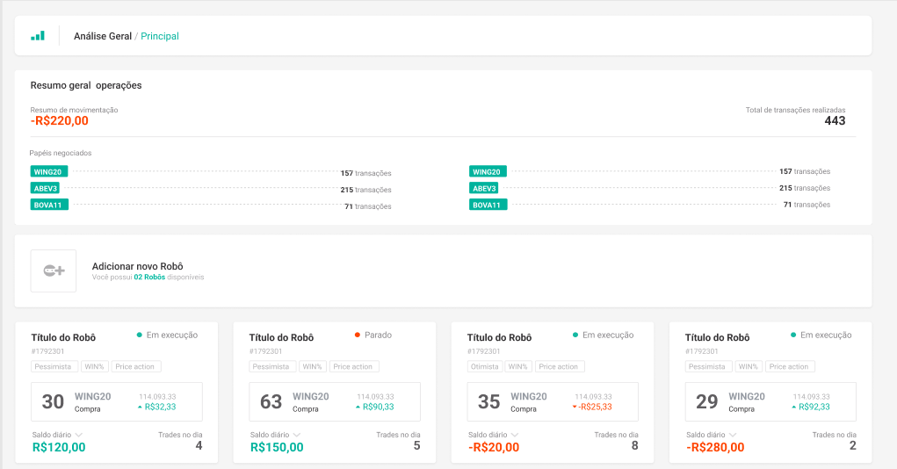

<h1 align="center">SMARTTBOT FRONT END CHALLENGE</h1>

</br>

<p align="center">
  
</p>

</br>

## 🧾 Sobre
Fala galera da Smarttbot, fico muito feliz por terem me considerado para fazer este desafio e curti demais fazê-lo também. Algumas observações que eu gostaria de mencionar:
- Durante a codificação, eu percebi que a API não estava atualizando os dados, ou seja, alguns dados não vinham com o objeto "last_paper" que contém os dados do atual paper (a não ser que eu tenha entendido errado, se for esse o caso peço perdão 😅). Então o que fiz foi colocar um "Carregando trade".
- Na página inicial estou mostrando 10 robôs por paginação, os robôs que são adicionados pelo POST estão aparecendo logo após os 10 primeiros.
- No layout do Figma está aparecendo para selecionar 2 estratégias: "Tangram" e "Price Action", porém na API Price Action é um type, fiquei meio perdido nessa parte, então coloquei dados padrões quando o Price Action é selecionado.

</br>

## 🧪 Tecnologias

Desenvolvi o projeto com as seguintes tecnologias:

- ReactJS
- Css Modules
- Sass
- Axios 
- React Hook Form
- React Spinners 
- React Toastify
- Yup 

</br>

## 🚀 Rodando o projeto

Clone o projeto e acesse a pasta:

```bash
git clone https://github.com/raphaeljcm/smarttbot-front-end-challenge.git

cd smarttbot-front-end-challenge

```

Rode esses comandos para instalar as dependências e rodar o projeto em develoment mode:

```bash
yarn install ou npm install
yarn start ou npm start

```
O projeto estará rodando em http://localhost:3000

</br>

## 💻 Preview
O preview do projeto pode ser visto [aqui](https://smarttbot-front-end-challenge.vercel.app/){:target="_blank"}

</br>

Feito com muito ☕ por Raphael Marques!
